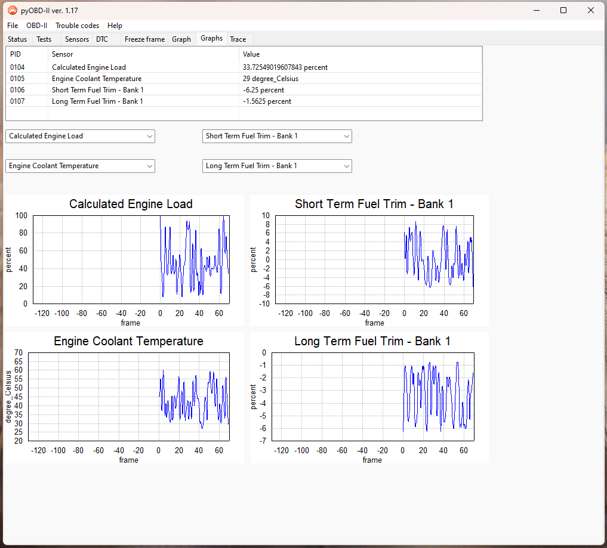

# 
PyOBD

A free and open-source software for vehicle ODB-II diagnostics.

## Installation

Binaries of this software for Windows, MacOS and Linux are available in the 
[releases](https://github.com/barracuda-fsh/pyobd/releases/tag/v1.16) section

## Documentation

See [Documentation](https://barracuda-fsh.github.io/pyobd/) for more on this software.