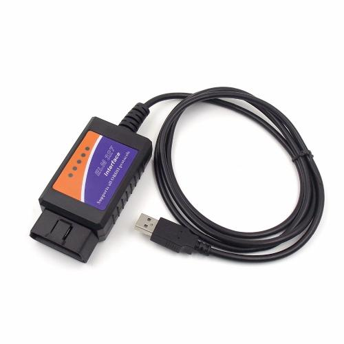

#  PYOBD 
This is the remake of the program pyobd, a free and open-source program for car diagnostics.
The program was originally made by Donour Sizemore a long time ago, but it wasn't operational for 
the last 15 years, so I upgraded it from Python 2 to Python 3 and all the new libraries to make it work again.
After that, I deleted the fixed commands and used the Python-OBD library, which supports a lot more commands 
and auto-detects what a car's computer supports, so it displays much more data than before.

# Table of Contents
1. [PYOBD](#pyobd)
   - [Overview](#overview)
   - [Prerequisites](#prerequisites)
   - [Installation](#installation)
      - [Windows](#windows-installation)
      - [Linux](#linux-installation)
      - [MacOS](#macos-installation)
   - [Usage](#usage)
   - [Development Setup](#development-setup)
      - [Note](#note)
      - [Running the GUI](#running-the-gui)
      - [Building and publishing a new package](#building-and-publishing-a-new-package)
      - [Creating an executable file](#creating-an-executable-file)
   - [To-Do List](#to-do-list)

## Prerequisites:
You need an ELM327 adapter, a laptop, and a car that supports OBD2 to use this program. All cars in Europe 
made since 2001 should support it. And in the USA, all cars made since 1996.

**Which ELM327 adapters have been reported to work? Most if not all adapters for $10 or more should work.**<br/>
This is the list of the ones I tried and worked:<br/>
* [OBDPro USB Scantool](http://www.obdpros.com/product_info.php?products_id=133)<br/>
* [OBDLink SX USB](https://www.obdlink.com/products/obdlink-sx/)<br/>
* Chinese OBD2 1.5 USB<br/>
* VGate iCar Pro BLE (Bluetooth 4.0). 


**Please write to me which adapters you have tested working with the app, so I can include it in the list. 
My e-mail is at the bottom of this readme.**

**NOTE: Both USB and bluetooth adapters work with this app, but under Linux I had to pair the bluetooth 
adapter manually via command line and then manually connect to it. It's probably because bluetooth GUI managers 
under Linux are buggy.**

**Which adapters are good?**</br>
* These may work, but not fully, and the ones that work (at least mostly) properly are $10 or more. 
  There are multiple reasons why a good adapter is not the cheapest. OBDLink makes good adapters, as does 
  VGate; their adapters also receive firmware updates, so while they are already very good, they keep improving. 
  This is what I found out after googling and reading about it for 3 days.
* USB Adapters
    * I recommend USB adapters for a stable and fast connection.
    * USB vLinker FS USB
        * If you want a trusted, good adapter, then I think the current USB vLinker FS USB is the best and 
        has a good price.
* Blutetooth Adapters
    * Bluetooth is slower and less reliable, and wireless has been reported as worse.
    * Vgate iCAR Pro
        * My reccomended choice of bluetooth adapter.
* Chinese clones 
    * If you really want to go buy a Chinese clone, I recommend one that has a 
    **PIC18F25K80 chip and FTDI chip (for USB)**, but even then, the firmware is also a factor; 1.5 should be 
    best (for a Chinese clone), but who knows what you will get. I.  If you want an affordable Chinese Elm327 
    that is branded, then go with the Konnwei KW903. It's about $15 with postage included. But iCar Pro is better.<br/>

## Installation
You may need to install `libsnl` when using linux if it didn't come prepacked with it

### Windows-Installation
Download the standalone executable and install the driver for your ELM327 device. 

If you have not received a driver with your adapter, then the drivers can be found 
[here](http://www.totalcardiagnostics.com/support/Knowledgebase/Article/View/1/0/how-to-install-elm327-usb-cable-on-windows-and-obd2-software)

### Linux-Installation
Download the standalone executable and add your user account the privileges of accesing USB and serial ports:</br>
**Note: After running these commands log out and log back in for it to take effect(or restart)**
```bash
sudo usermod -a -G dialout $USER
sudo usermod -a -G tty $USER 
```

For bluetooth adapters, you will probably need to install this:
```bash
sudo apt-get install bluetooth bluez-utils blueman
```

### MacOS-Installation
Download the standalone executable and add your user account the privileges of accesing USB and serial ports: </br>
**Note: After running these commands log out and log back in for it to take effect(or restart)**
```bash
sudo usermod -a -G dialout $USER 
sudo usermod -a -G tty $USER 
```

## Usage
For bluetooth adapters, you will need to pair the adapter once and then connect to it(for some reason on Linux 
I had to connect to it manually via command line).

Run the executable or the script, connect the ELM327 to the computer and the car's OBD port, set the iginition 
on the car to on(you don't have to start the engine) and click CONNECT in the app. To connect, go to Configure, 
select the right port and the right baudrate and click connect. You can leave it at AUTO and connect, but it 
will take longer to connect and in some cases it will not connect. Manual is safest and fastest, but AUTO 
works in most cases.

**UPDATE: automatic port and baud detection should now work every time!**

The data will display once you are connected, although most of the sensors display data only when the engine is running. 
If you connected and then turn the engine on, you have to wait a bit so that the program reconnects.

The program was made with ease of use in mind. With it you can view TESTS data, SENSORS data, FREEZE FRAME data, 
display and clear the TROUBLE CODES and view live GRAPHS. Currently it only displays live data - no recording and 
replay is possible.

**NOTE: The program only displays the engine data, not airbags, ABS and body control systems. Even if your adapter 
supports that, you will need a more specialized program for that.**

## Development Setup
This project requires `python=3.9,<=3.11` and now uses [poetry](https://python-poetry.org/) for packaging and 
managing its dependencies. You need to have `poetry` installed globally on you development machine. You can
install it with `pip install poetry`.

### Note
Before following the steps below, you might need to install some packages for this project to work properly based
on you operating system. For example, you may need to install `libsnl` when using linux if it didn't come 
prepacked with it.

On Debian 10 and 11 and on Ubuntu, type these commands to install the requirements(on Ubuntu replace 
`libgstreamer-plugins-base1.0` with `libgstreamer-plugins-base1.0-0`): 
```bash
sudo apt-get install dpkg-dev build-essential libjpeg-dev libtiff-dev libsdl1.2-dev libgstreamer-plugins-base1.0 \
libnotify-dev freeglut3 freeglut3-dev libsm-dev libgtk-3-dev libwebkit2gtk-4.0-dev libxtst-dev gettext python3-dev \
python3-pip
```

For Mac and Linux users:

**Note: After running the commands below log out and log back in for it to take effect(or restart)**
```bash
sudo usermod -a -G dialout $USER
sudo usermod -a -G tty $USER
```

Steps:
- clone this repository.
    ```bash
  git clone https://github.com/barracuda-fsh/pyobd.git
    ```
- switch to the projects root directory.
    ```bash
  cd pyobd
    ```
- install the project's dependencies
    ```bash
  poetry install && poetry shell
    ```

### Running the GUI

After all the project dependencies have been installed you can launch the programs GUI with `poetry run pyobd`.

### Building and publishing a new package

To generate new python packages for this project. Run `poetry build`. the artifacts generated will be found in the
`dist/` directory in the project's root. To publish the project to [pypi](https://pypi.org/), run `poetry publish`

### Creating an executable file
From the project root, run:
```bash 
pyinstaller --onefile -w -i pyobd2/assets/pyobd.ico --add-data "pyobd2/assets/pyobd.ico:." pyobd2/pyobd.py
```

## TO-DO LIST:
### Adding sensor data recording and replay feature.</br>

